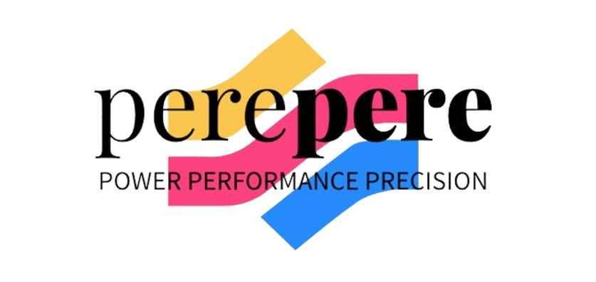

<!-- Improved compatibility of back to top link: See: https://github.com/othneildrew/Best-README-Template/pull/73 -->

<!--
*** Thanks for checking out the Best-README-Template. If you have a suggestion
*** that would make this better, please fork the repo and create a pull request
*** or simply open an issue with the tag "enhancement".
*** Don't forget to give the project a star!
*** Thanks again! Now go create something AMAZING! :D
-->

<!-- PROJECT SHIELDS -->
<!--
*** I'm using markdown "reference style" links for readability.
*** Reference links are enclosed in brackets [ ] instead of parentheses ( ).
*** See the bottom of this document for the declaration of the reference variables
*** for contributors-url, forks-url, etc. This is an optional, concise syntax you may use.
*** https://www.markdownguide.org/basic-syntax/#reference-style-links
-->

<!-- PROJECT LOGO -->
 

  

  <h3 align="center">Team Pere Pere</h3>

  

    
Post-Traumatic Stress Disorder (PTSD) is a mental health condition that can develop after someone experiences or witnesses a traumatic event. Symptoms include flashbacks, nightmares, anxiety, hypervigilance, and avoidance of reminders of the trauma. PTSD can cause emotional numbness, depression, and difficulty with relationships. Treatment typically involves therapy, such as Cognitive Behavioral Therapy (CBT), and sometimes medication to manage symptoms. Left untreated, PTSD can significantly affect a person's life and well-being.
     
  

<!-- TABLE OF CONTENTS -->

  
Table of Contents

  <ol>
    <li>
      <a href="#about-the-project">About The Project</a>
      <ul>
        <li><a href="#built-with">Built With</a></li>
      </ul>
    </li>
    <li>
      <a href="#dataset">About the Dataset</a>
      <ul>
        <li><a href="#prerequisites">Prerequisites</a></li>
        <li><a href="#installation">Installation</a></li>
      </ul>
    </li>
    <li><a href="#usage">Usage</a></li>
    <li><a href="#roadmap">Roadmap</a></li>
    <li><a href="#contributing">Contributing</a></li>
    <li><a href="#acknowledgments">Acknowledgments</a></li>
  </ol>

<!-- ABOUT THE PROJECT -->
## About The Project

 Project Overview: This project focuses on exploring Post-Traumatic Stress Disorder (PTSD), a mental health condition that affects individuals after experiencing or witnessing traumatic events. The aim is to raise awareness about PTSD, its symptoms, and treatment options while providing support and resources to those impacted by the disorder.

Objectives: how it affects people, and the common symptoms such as flashbacks, anxiety, and emotional numbness. It will also explore current treatment methods, including therapy and medication, and create resources for individuals affected by PTSD. Raising awareness and reducing the stigma surrounding mental health is a core goal

Scope and Methodology: The project will involve a literature review of existing research on PTSD and its impact on different populations. Interviews with mental health professionals and survivors will provide valuable insights. The project will also include workshops, seminars, and awareness campaigns to educate the public and encourage people to seek help.
Treatment and Support: The project will focus on available treatment options such as Cognitive Behavioral Therapy (CBT), Eye Movement Desensitization and Reprocessing (EMDR), and support groups. It will also provide information on how to access these treatments and services.

(<a href="#readme-top">back to top</a>)

## Dataset
Dataset Information:

### EDA

## Models

Here are some Modelling we performed

## Results

